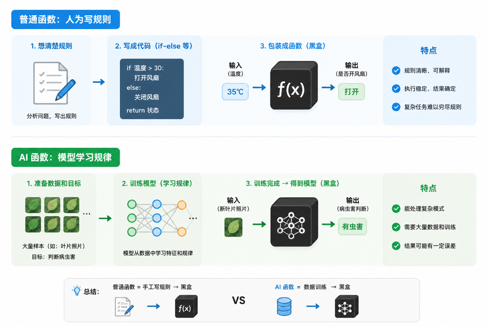
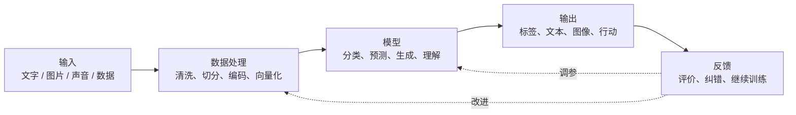
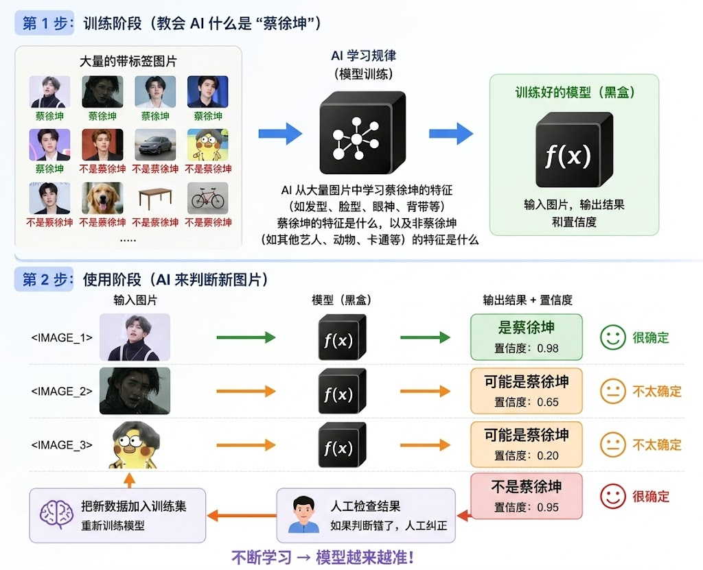
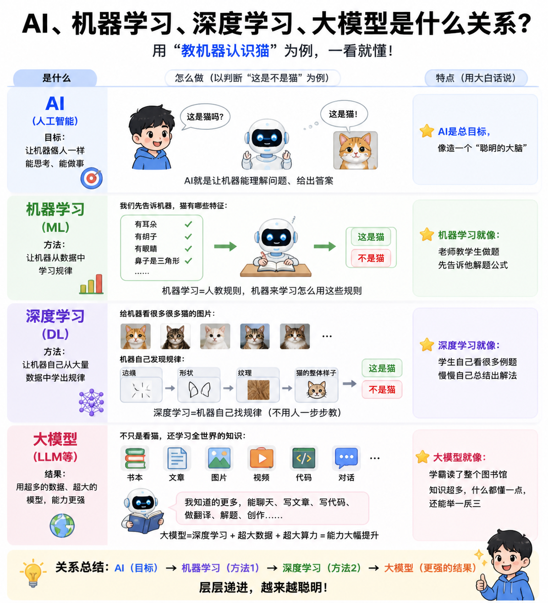
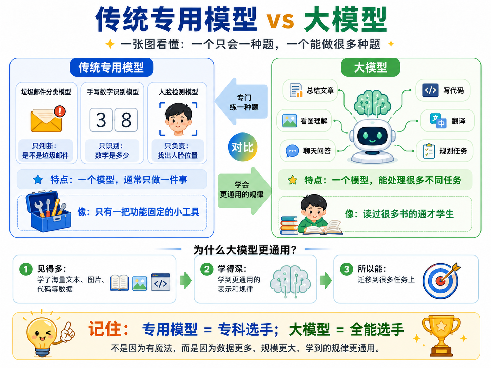
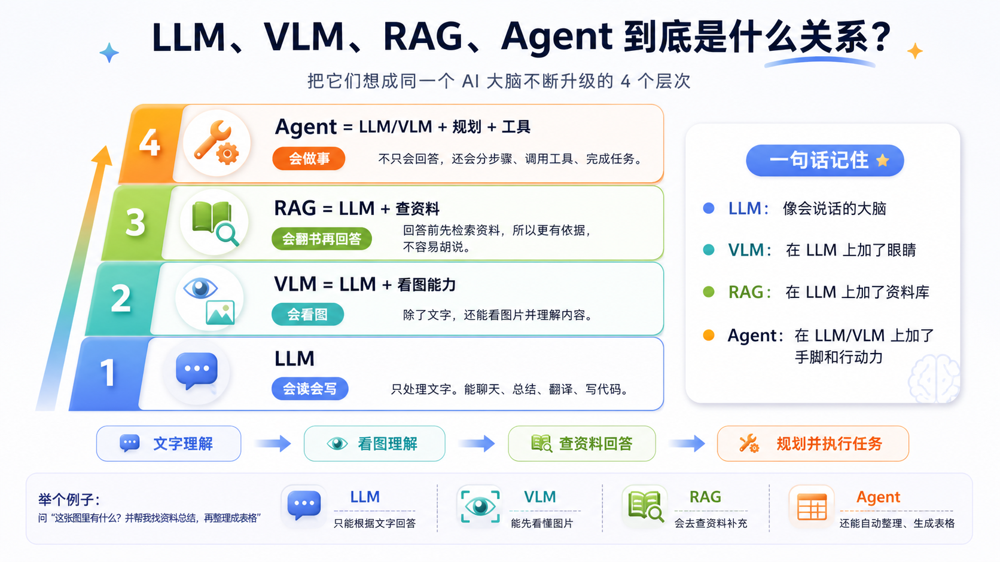
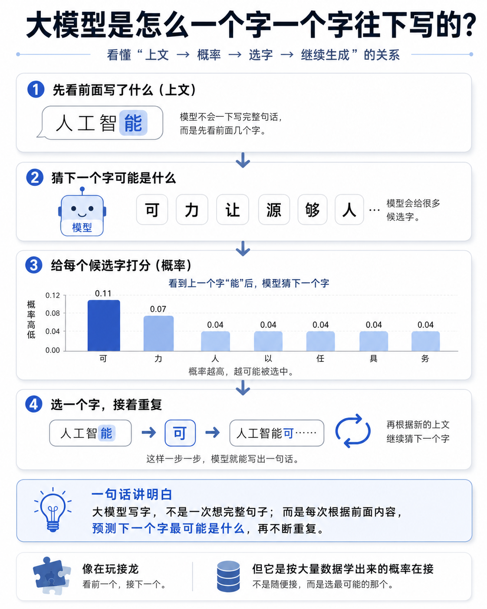

# 第 1 章：人工智能概述

这一章先不急着写复杂代码。先建立一个核心直觉：

```text
输出 = AI(输入)
```

你给它一段文字、一张图片、一段声音或一个任务，它经过模型处理后，给你一个结果。

本章目标：

1. 理解 AI 是什么。
2. 理解 AI 为什么可以看成一个函数。
3. 看懂一个 AI 系统的基本组成。
4. 分清机器学习、深度学习、大模型、VLM、RAG、Agent 的位置。
5. 建立后续 8 次课的学习路线。

## 1. 从函数开始理解 AI

你已经学过函数：

```text
y = f(x)
```

`x` 是输入，`f` 是处理规则，`y` 是输出。

AI 也可以这样看：

```text
输出 = AI模型(输入)
```

例子：

```text
“请总结这段文章” → AI模型 → 一段摘要
一张人物图片 → AI模型 → 判断是不是某个人
一个用户的浏览记录 → AI模型 → 推荐内容
一句语音 → AI模型 → 文字
```

先把 AI 当成函数，就不会被复杂名词吓住。后面所有系统，本质上都围绕“输入、模型、输出、反馈”展开。

## 2. 普通函数和 AI 函数的区别

普通函数通常是人直接写规则。

AI 函数的关键是：**很多规则不是人手写的，而是模型从大量样本中学出来的。**



## 3. 一个 AI 系统的完整架构

真实 AI 系统不只是一个模型。它通常包含下面这些部分：

```text
输入 → 数据处理 → 模型 → 输出 → 反馈
```

这条链路就是 AI 系统的骨架。



### 例子：找到某个人

把刚才的架构落到一个具体任务：

- 训练阶段：给模型大量带标签图片，让它学习目标人物的视觉特征。
- 使用阶段：输入一张新图片，模型输出“是不是目标人物”和置信度。



可以把每一部分想成工厂里的不同环节：

- **输入**：原材料进来。
- **数据处理**：把原材料整理成机器能处理的格式。
- **模型**：核心加工机器。
- **输出**：成品出来。
- **反馈**：检查成品质量，用来改进系统。

## 4. 模型到底在“学”什么

模型学习的不是一句神秘咒语，而是参数。

可以先这样理解：

```text
输出 = 模型(输入, 参数)
```

训练的过程，就是不断调整参数，让输出越来越接近正确答案。

### 极简训练过程

```python
import numpy as np

np.random.seed(5)

x = np.linspace(0, 10, 40)
y = 2.3 * x + 4 + np.random.normal(0, 2.2, size=len(x))

w, b = 0.0, 0.0
lr = 0.004

for step in range(180):
    pred = w * x + b
    loss = ((pred - y) ** 2).mean()

    dw = (2 * x * (pred - y)).mean()
    db = (2 * (pred - y)).mean()

    w -= lr * dw
    b -= lr * db
```

这个小实验虽然简单，但已经包含了 AI 训练的核心：

1. 有输入和正确输出。
2. 模型先随便猜。
3. 计算猜得有多差，这叫损失。
4. 调整参数。
5. 重复很多次。

神经网络、大模型训练也遵循这个方向，只是函数更复杂、参数更多、数据更大。

## 5. AI、机器学习、深度学习、大模型的关系

很多同学一开始会把这些词混在一起。它们不是并列关系，而是包含关系。



一句话记忆：

```text
AI 是大目标，机器学习是让机器从数据中学习，深度学习是用神经网络学习，大模型是神经网络做大之后的代表。
```

## 6. 为什么今天的大模型这么重要

大模型的特殊之处在于：它不只会做一个任务，而是可以通过自然语言适配很多任务。

过去很多 AI 系统像“专用工具”：一个模型做一个任务。

大模型更像“通用接口”：你用自然语言告诉它要做什么。



## 7. LLM、VLM、RAG、Agent 在架构里的位置

常见新词可以放回“AI 函数”的架构中理解：



- **LLM**：大语言模型，主要处理文本输入和文本输出。
- **VLM**：视觉语言模型，可以同时处理图像和文字。
- **RAG**：检索增强生成，让模型先查资料，再回答。
- **Agent**：能规划步骤、调用工具、根据反馈继续执行任务的 AI 系统。

## 8. 生成式 AI 的直觉：预测下一个符号

语言模型的一个核心思想是：根据前面的上下文，预测下一个 token。

为了直观理解，可以做一个极小的字符生成实验。它不是大模型，但能展示生成的基本味道。



小模型生成得不一定通顺，原因很简单：它只看很短的上下文，能力太弱。

真正的大模型会看很长的上下文，并用神经网络学习更深的关系，所以能生成更连贯、更有逻辑的回答。

但最底层的直觉仍然重要：

```text
根据上下文 → 预测下一个 token → 接着再预测下一个 token → 形成完整输出
```

## 9. AI 系统为什么需要数据、算力、算法和工程

一个 AI 系统能不能做好，不只看模型名字。至少要看四件事：

- **数据**：模型从哪里学习。
- **算力**：模型有没有足够计算资源训练和运行。
- **算法**：用什么方法学习规律。
- **工程**：怎么把模型做成稳定可用的系统。

课堂和真实项目里，工程经常和模型同样重要。

## 10. 本课程 8 次课学习路线

接下来不是零散地学名词，而是沿着 AI 函数一步步拆开。

| 次序 | 主题 | 重点 |
| --- | --- | --- |
| 1 | 人工智能概述 | 把 AI 看成函数，理解输入、模型、输出和反馈 |
| 2 | 机器学习基础 | 数据、特征、训练、损失、泛化 |
| 3 | 神经网络基础 | 神经元、计算图、梯度、反向传播 |
| 4 | 深度学习模型 | CNN、RNN、注意力、Transformer |
| 5 | AI 语言与工具 | Python、Notebook、Prompt、API、向量工具 |
| 6 | 计算机视觉 | 图像分类、CNN、目标检测、VLM |
| 7 | 自然语言处理 | 分词、词向量、Transformer、LLM |
| 8 | 大模型与 AIGC | Prompt、RAG、Agent、生成式应用 |

## 11. 本章小结

这一章只需要牢牢记住一件事：

```text
AI 是一个从输入到输出的函数，只不过这个函数很多时候是从数据中学出来的。
```

围绕这个函数，有五个关键部分：

1. 输入：文字、图像、声音、结构化数据。
2. 数据处理：把输入变成机器能计算的形式。
3. 模型：学习到的函数。
4. 输出：判断、预测、生成、行动。
5. 反馈：评价结果，并帮助系统改进。

后面的课程就是不断拆解这个函数：它怎么学习，怎么用神经网络表达，怎么处理图像和语言，怎么连接知识库，怎么调用工具完成任务。

## 课后思考

1. 如果把 ChatGPT 看成一个函数，它的输入和输出分别是什么？
2. 如果把“从图片中找到某个人”看成一个 AI 函数，需要哪些输入数据？输出应该是什么？
3. 普通程序和 AI 模型最大的区别是什么？
4. 为什么大模型需要 RAG？
5. Agent 比普通聊天机器人多了什么能力？
