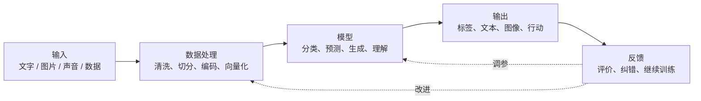
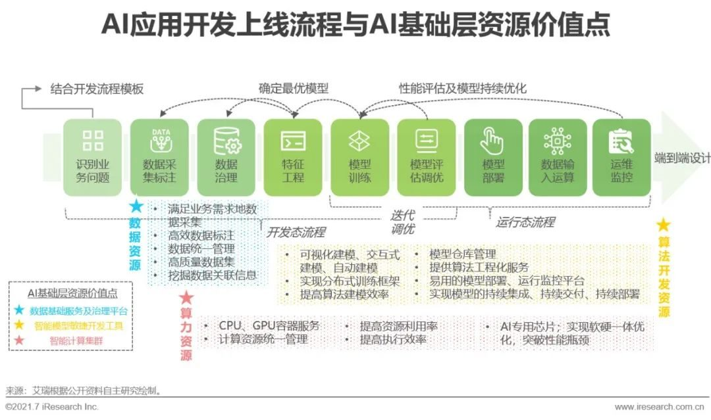
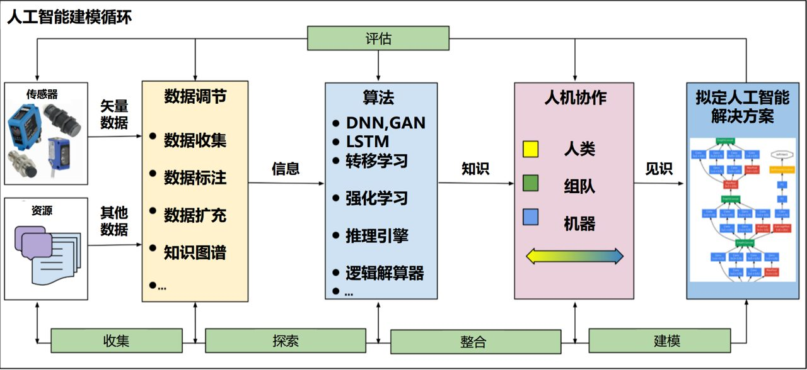
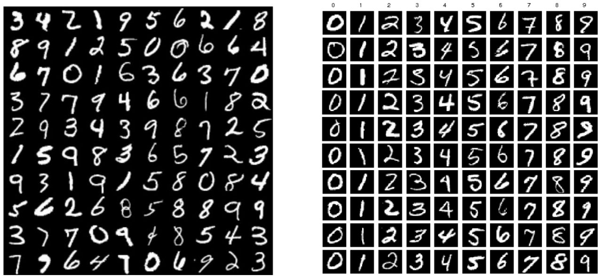
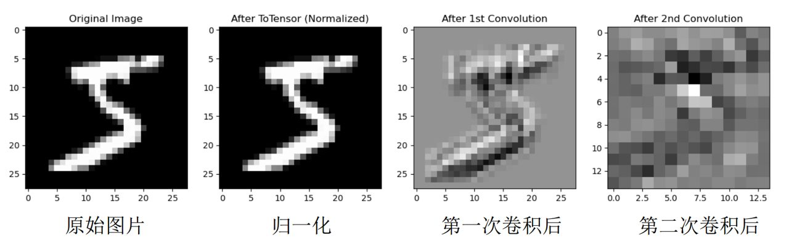
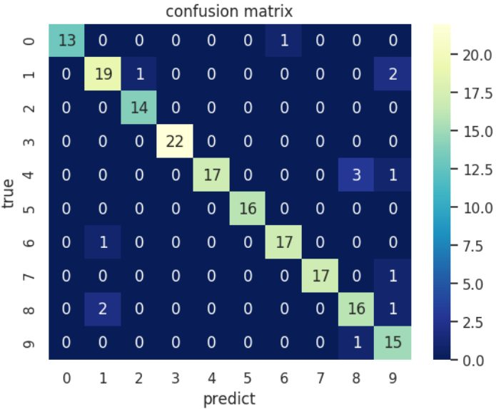
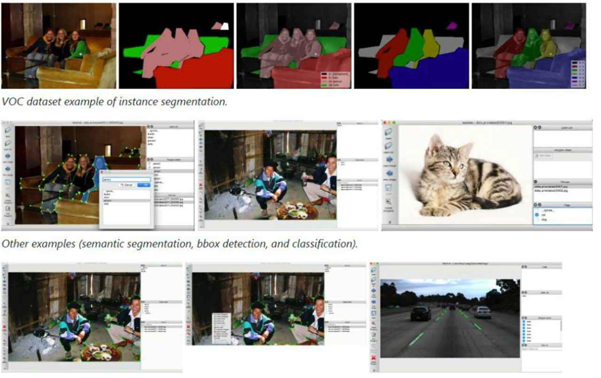
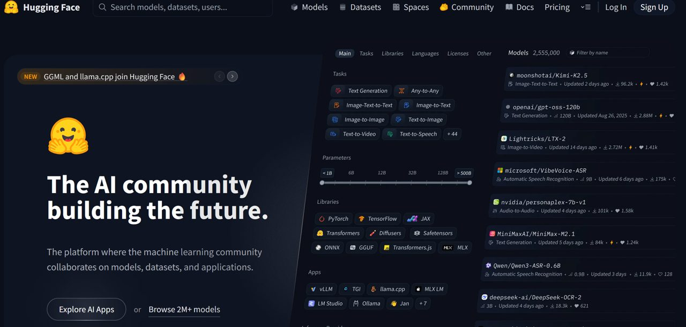

# 第 1 章：人工智能概述

这一章先不急着写复杂代码。先建立一个核心直觉：

```text
输出 = 大模型(输入)
```

你给大模型一段文字、一张图片、一段资料或一个问题，它经过模型处理后，给你一个结果。

本章目标：

1. 理解 AI、大模型、Agent 的关系。
2. 理解大模型为什么可以看成一个函数。
3. 看懂一个 AI 系统的基本组成。
4. 分清机器学习、深度学习、大模型、VLM、RAG、Agent 的位置。
5. 建立后续 8 次课的学习路线。

## 1. 从函数开始理解大模型

你已经学过函数：

```text
y = f(x)
```

`x` 是输入，`f` 是处理规则，`y` 是输出。

大模型也可以这样看：

```text
输出 = 大模型(输入)
```

例子：

```text
“请总结这段文章” → 大语言模型 → 一段摘要
一张图片 + 一个问题 → 多模态大模型 → 对图片的回答
一段资料 + 一个问题 → 大模型 → 基于资料的回答
一个任务目标 → Agent 系统 → 规划步骤并调用工具
```

先把大模型当成函数，就不会被复杂名词吓住。后面的大模型应用，本质上都围绕“输入、模型、输出、反馈”展开。

## 2. 普通函数和大模型函数的区别

普通函数通常是人直接写规则。

大模型函数的关键是：**很多规则不是人手写的，而是模型从大量样本中学出来的。**


## 3. 一个 AI 系统的完整架构

真实 AI 系统不只是一个模型。它通常包含下面这些部分：

```text
输入 → 数据处理 → 模型 → 输出 → 反馈
```

这条链路就是 AI 系统的骨架。



### 例子：找到某个人

把刚才的架构落到一个具体任务：

- 训练阶段：给模型大量带标签图片，让它学习目标人物的视觉特征。
- 使用阶段：输入一张新图片，模型输出“是不是目标人物”和置信度。


可以把每一部分想成工厂里的不同环节：

- **输入**：原材料进来。
- **数据处理**：把原材料整理成机器能处理的格式。
- **模型**：核心加工机器。
- **输出**：成品出来。
- **反馈**：检查成品质量，用来改进系统。

### 做 AI 项目先问什么

很多初学者一上来就想“写代码、选模型、找论文”。这不是最稳的起点。

真正的起点应该是：

```text
你到底要解决什么问题？
```

一个 AI 项目开始前，至少要说清楚三件事：

1. **输入是什么**：文本、图片、声音、表格，还是多个输入一起用。
2. **输出是什么**：分类标签、预测数值、生成文本、检测框，还是具体动作。
3. **怎么判断好不好**：准确率、召回率、F1、延迟、成本，还是人工验收。

如果这三件事说不清楚，后面模型再复杂也容易走偏。



## 4. 模型到底在“学”什么

模型学习的不是一句神秘咒语，而是参数。

可以先这样理解：

```text
输出 = 模型(输入, 参数)
```

训练的过程，就是不断调整参数，让输出越来越接近正确答案。

### 极简训练过程

```python
import numpy as np

np.random.seed(5)

x = np.linspace(0, 10, 40)
y = 2.3 * x + 4 + np.random.normal(0, 2.2, size=len(x))

w, b = 0.0, 0.0
lr = 0.004

for step in range(180):
    pred = w * x + b
    loss = ((pred - y) ** 2).mean()

    dw = (2 * x * (pred - y)).mean()
    db = (2 * (pred - y)).mean()

    w -= lr * dw
    b -= lr * db
```

这个小实验虽然简单，但已经包含了 AI 训练的核心：

1. 有输入和正确输出。
2. 模型先随便猜。
3. 计算猜得有多差，这叫损失。
4. 调整参数。
5. 重复很多次。

神经网络、大模型训练也遵循这个方向，只是函数更复杂、参数更多、数据更大。

## 5. AI、机器学习、深度学习、大模型的关系

很多同学一开始会把这些词混在一起。它们不是并列关系，而是包含关系。


一句话记忆：

```text
AI 是大目标，机器学习是让机器从数据中学习，深度学习是用神经网络学习，大模型是神经网络做大之后的代表。
```

## 6. 为什么今天的大模型这么重要

大模型的特殊之处在于：它不只会做一个任务，而是可以通过自然语言适配很多任务。

过去很多 AI 系统像“专用工具”：一个模型做一个任务。

大模型更像“通用接口”：你用自然语言告诉它要做什么。


## 7. LLM、VLM、RAG、Agent 在架构里的位置

常见新词可以放回“大模型函数”的架构中理解：


- **LLM**：大语言模型，主要处理文本输入和文本输出。
- **VLM**：视觉语言模型，可以同时处理图像和文字。
- **RAG**：检索增强生成，让大模型先查资料，再基于资料回答。
- **Agent**：不是单纯的大模型本身，而是围绕大模型搭起来的执行系统。它会规划步骤、调用工具、观察结果，并根据反馈继续行动。

简单区分：

```text
大模型：负责理解和生成
RAG：给大模型补充外部知识
Agent：让大模型参与规划、调用工具和执行任务
```

## 8. 生成式大模型的直觉：预测下一个符号

语言模型的一个核心思想是：根据前面的上下文，预测下一个 token。

为了直观理解，可以做一个极小的字符生成实验。它不是大模型，但能展示生成的基本味道。


小模型生成得不一定通顺，原因很简单：它只看很短的上下文，能力太弱。

真正的大模型会看很长的上下文，并用神经网络学习更深的关系，所以能生成更连贯、更有逻辑的回答。

但最底层的直觉仍然重要：

```text
根据上下文 → 预测下一个 token → 接着再预测下一个 token → 形成完整输出
```

## 9. AI 系统为什么需要数据、算力、算法和工程

一个 AI 系统能不能做好，不只看模型名字。至少要看四件事：

- **数据**：模型从哪里学习。
- **算力**：模型有没有足够计算资源训练和运行。
- **算法**：用什么方法学习规律。
- **工程**：怎么把模型做成稳定可用的系统。

课堂和真实项目里，工程经常和模型同样重要。

### 数据质量决定上限

AI 项目里有一个很实用的原则：

```text
Garbage In, Garbage Out
```

输入数据质量差，输出结果通常也不会好。模型不能自动修复所有脏数据。

常见数据问题：

- **缺失值**：关键信息为空。
- **异常值**：明显不符合真实情况。
- **重复数据**：同一条样本反复出现。
- **类别不均衡**：某些类别样本很多，某些类别很少。
- **标签噪声**：标注结果本身就是错的。
- **数据授权和隐私问题**：数据能不能合法使用。

所以数据预处理不是形式步骤，而是模型效果的基础。

## 10. 一个 AI 项目的完整流程

从工程视角看，AI 项目不是“写模型 + 训练”这么简单。一个完整流程通常包括：

```text
问题定义 → 数据收集 → 数据预处理 → 模型选择 → 模型训练 → 模型评估 → 模型优化 → 模型部署 → 模型监控与维护 → 文档总结
```



### 1. 问题定义

明确目标、输入、输出和评价标准。

例子：手写数字识别的输入是一张数字图片，输出是 `0-9` 中的一个类别。这是多分类问题。



### 2. 数据收集

数据可以来自数据库、API、传感器、文本、图片、公开数据集或人工采集。

数据不是越多越好。关键是数据是否和真实问题一致，是否干净，是否有合法授权。

### 3. 数据预处理

把原始数据变成模型更容易学习的形式。

常见操作：

- 清洗缺失值、异常值、重复数据。
- 做标准化或归一化。
- 选择和任务最相关的特征。
- 对图像做旋转、平移、缩放等数据增强。



### 4. 模型选择

模型不是越复杂越好。要看问题复杂度、数据规模、计算资源、实时性要求和可解释性要求。

小数据直接上大模型，容易过拟合。简单模型有时更稳定、更容易部署。

### 5. 模型训练

训练时通常要划分：

- **训练集**：用来学习参数。
- **验证集**：用来调参和选择模型。
- **测试集**：用来评估最终泛化能力。

训练本质上是不断调整参数，让损失下降。

### 6. 模型评估

不同任务要看不同指标。

- **准确率**：预测正确的比例，直观但不总是够用。
- **精确率**：预测为正的样本里，有多少是真的正。
- **召回率**：真实为正的样本里，有多少被找出来。
- **F1 分数**：精确率和召回率的综合指标。
- **混淆矩阵**：看每个类别具体错在哪里。

类别不均衡时，不能只看准确率。



### 7. 模型优化

优化不只改模型，也可以改数据和训练策略。

- 调学习率、批大小、训练轮数。
- 加正则化、Dropout，减少过拟合。
- 清洗错误样本，补充少数类别样本。
- 换更合适的模型结构。

### 8. 模型部署

模型只有进入真实系统，才算真正产生价值。

常见部署方式：

- 保存模型为标准格式，如 ONNX。
- 封装成 API，让外部系统调用。
- 做实时推理或批量推理。
- 嵌入到 App、网站、业务系统或边缘设备中。

### 9. 模型监控与维护

部署不是终点。真实环境会变化，模型效果也会变。

需要持续关注：

- 预测准确性是否下降。
- 输入数据分布是否变化。
- 响应速度和系统成本是否可接受。
- 是否需要重新训练或更新模型。

### 10. 文档与总结

把数据来源、处理步骤、模型选择理由、实验结果和部署方式记录下来。

文档不是额外负担，而是后续复现、协作和迭代的基础。

## 11. 开发语言、标注、框架和开源资源

### 为什么 AI 开发常用 Python

Python 不一定是性能最强的语言，但它在 AI 领域最常用，核心原因是生态成熟、开发效率高。

选择开发语言时要看：

- **生态系统**：有没有 NumPy、Pandas、PyTorch、TensorFlow 等库。
- **开发效率**：能不能快速实验和调试。
- **性能要求**：是否需要 C++、CUDA 或高性能部署方案。
- **社区和文档**：遇到问题是否容易找到资料。

其他语言也有价值：

- **R**：适合统计分析和可视化。
- **Java**：适合企业级系统集成。
- **C++**：适合高性能计算、底层系统和部署优化。

### 数据标注为什么重要

监督学习里，模型常常靠“数据 + 标签”学习。

数据标注的本质是：把人的认知加入数据，让机器按人的意图学习。

常见标注类型：

- **图像标注**：分类标签、检测框、多边形、语义分割、实例分割。
- **文本标注**：分类、情感、词性、命名实体、语法结构。
- **语音标注**：语音转文字、语音分段。
- **视频标注**：物体、行为、事件。

标注质量会直接影响模型上限。标签错了，模型学到的规律也会错。



### 常用框架和资源

常见深度学习框架：

- **PyTorch**：动态图、调试方便，科研和教学中很常用。
- **TensorFlow / Keras**：生态完整，适合快速构建模型和工程部署。
- **PaddlePaddle / MindSpore / MXNet**：在不同产业和平台场景中有对应生态。

常用开源资源平台：

- **GitHub**：找代码、读 README、看 Star、Issue、提交频率和维护状态。
- **Kaggle**：找数据集、竞赛方案和 Notebook 示例。
- **Hugging Face**：找模型、数据集、论文趋势和大模型应用资源。



判断一个开源项目是否值得学习，可以看：

1. README 是否清楚。
2. 最近是否还在维护。
3. Star、Fork、Issue 是否活跃。
4. 是否有安装说明、示例代码和许可证。
5. 是否和自己的任务匹配。

## 12. 本课程 8 次课学习路线

接下来不是零散地学名词，而是沿着“大模型函数 + AI 工程系统”一步步拆开。

| 次序 | 主题 | 重点 |
| --- | --- | --- |
| 1 | 人工智能概述 | 把大模型看成函数，理解输入、模型、输出、反馈和 Agent 的区别 |
| 2 | 机器学习基础 | 数据、特征、训练、损失、泛化 |
| 3 | 神经网络基础 | 神经元、计算图、梯度、反向传播 |
| 4 | 深度学习模型 | CNN、RNN、注意力、Transformer |
| 5 | AI 语言与工具 | Python、Notebook、Prompt、API、标注工具、向量工具 |
| 6 | 计算机视觉 | 图像分类、CNN、目标检测、VLM |
| 7 | 自然语言处理 | 分词、词向量、Transformer、LLM |
| 8 | 大模型与 AIGC | Prompt、RAG、Agent、生成式应用 |

## 13. 本章小结

这一章只需要牢牢记住一件事：

```text
大模型可以看成一个从输入到输出的函数，只不过这个函数是从大量数据中学出来的。
```

围绕这个函数，有五个关键部分：

1. 输入：文字、图像、声音、结构化数据。
2. 数据处理：把输入变成机器能计算的形式。
3. 模型：学习到的函数。
4. 输出：判断、预测、生成、行动。
5. 反馈：评价结果，并帮助系统改进。

从工程视角看，还要记住：

```text
AI 能力 = 数据质量 × 算法设计 × 工程流程 × 生态支持
```

后面的课程就是不断拆解这个“大模型函数”：它怎么学习，怎么用神经网络表达，怎么处理图像和语言，怎么连接知识库；再进一步看 Agent 如何把大模型、工具和反馈循环组合成真实可用的系统。

## 课后思考

1. 如果把 ChatGPT 看成一个函数，它的输入和输出分别是什么？
2. 如果把“从图片中找到某个人”看成一个大模型或视觉模型函数，需要哪些输入数据？输出应该是什么？
3. 普通程序和大模型最大的区别是什么？
4. 为什么大模型需要 RAG？
5. Agent 比普通聊天机器人多了什么能力？
6. 一个 AI 项目为什么不能从“直接选模型”开始？
7. 数据标注质量为什么会影响模型效果？
